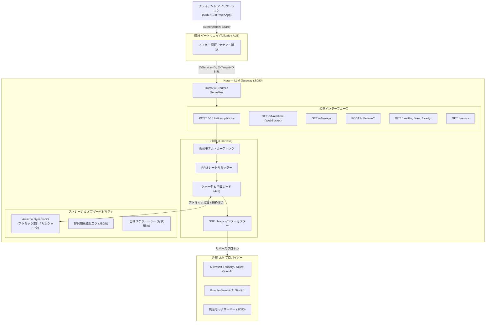

# Kura — Lightweight Multi-Tenant LLM Gateway

[](https://go.dev/)
[](https://huma.rocks/)
[](https://spec.openapis.org/oas/v3.1.0)
[](https://aws.amazon.com/dynamodb/)
[](https://www.docker.com/)
[](LICENSE)

**Kura** は、マルチテナント・複数プロダクト環境における大規模言語モデル（Microsoft Foundry / Azure OpenAI、Google Gemini 等）へのアクセスを一元管理・中継する、超軽量・極低レイテンシーな LLM API ゲートウェイです。

Standard Go Project Layout（クリーンアーキテクチャ）を採用し、OpenAI 互換インターフェース、リアルタイムなクォータ・コストガード、仮想モデルルーティング、国内データレジデンシーをミニマルかつ高パフォーマンスに提供します。

---

## 主な機能

- **OpenAI 互換プロキシ (`/v1/chat/completions`)**:
  - 単一のエンドポイントで各種プロバイダー（Microsoft Foundry, Google Gemini）を中継。
  - 完全非バッファリングの SSE ストリーミング対応。最終フレームから正確なトークン使用量をリアルタイムインターセプト。
  - 各ベンダーの新機能パラメータ（`thinking`, `reasoning_effort` 等）を未知パラメータとしてそのまま透過。
- **仮想モデルエイリアス (Routing & Fallback)**:
  - アプリ側コードを変更せずに、`fast` / `default` (`gpt-5.4-mini`)、`smart` (`claude-3-5-sonnet`)、`flash` (`gemini-2.5-flash`) などの共通エイリアスで裏側のモデルを柔軟に切り替え。
- **確実なコストガード & マルチテナント制御**:
  - Amazon DynamoDB（Single Table Design）によるミリ秒単位のアトミックなトークン・コスト集計（インメモリフォールバック対応）。
  - 月間予算上限到達時の即時自動遮断 (`429 Too Many Requests`)。
  - テナント・サービス単位のオンデマンドな分間リクエスト制御（RPM スライディングウィンドウ）。
- **リアルタイム通信**:
  - `/v1/realtime` の WebSocket 双方向パススルー中継。
- **メタデータ・透過タグ収集**:
  - 事前マスタ定義なしで、`X-Environment`, `X-Feature`, `X-Tags` ヘッダーを自動収集し非同期構造化ログに付与。
- **クラウドネイティブ運用**:
  - `/healthz`（総合）、`/livez`（Liveness）、`/readyz`（Readiness）プローブによる Kubernetes / ECS 完全適合。
  - `/metrics` による Prometheus パフォーマンス・コストメトリクス公開。
  - 内蔵 Goroutine と DynamoDB 分散ロックによる完全自律型の月次集計・Slack アラート通知（外部バッチ不要）。
- **Scalar API ドキュメント & OpenAPI 3.1 自動生成**:
  - Huma v2 により、最新の対話的 API ドキュメント（Scalar）と OpenAPI 3.1 スキーマを起動時に自動生成。

---

## アーキテクチャ



---

## クイックスタート

### 前提条件
- [Go](https://go.dev/) 1.25 以上
- [Docker](https://www.docker.com/) または [nerdctl](https://github.com/containerd/nerdctl) / Docker Compose

### 1. リポジトリのクローン & セットアップ
```bash
git clone https://github.com/northfieldzz/kura.git
cd kura
cp .env.example .env  # 必要に応じて環境変数を編集
```

### 2. コンテナでの起動 (推奨)
```bash
# 全体スタック (Gateway + DynamoDB Local + Mock LLM Server) を起動
docker compose --profile database up -d --build
# または nerdctl
nerdctl compose --profile database up -d --build
```

起動後、各サービスへアクセス可能です：
- **Kura Gateway**: `http://localhost:8080`
- **Scalar API ドキュメント**: `http://localhost:8080/docs`
- **OpenAPI 3.1 仕様書**: `http://localhost:8080/openapi`
- **統合 LLM モックサーバー**: `http://localhost:8090`
- **DynamoDB Admin UI**: `http://localhost:8001`

### 3. Go 単体での起動
```bash
go run ./cmd/server
```
※ DynamoDB が未起動の場合は、自動的にインメモリストアへフォールバックして即座に起動します。

---

## API リクエスト例

### 1. ヘルスチェック
```bash
curl -i http://localhost:8080/healthz
```

### 2. チャット補完 (OpenAI 互換・メタデータ付与)
```bash
curl -X POST http://localhost:8080/v1/chat/completions \
  -H "X-Service-ID: service-core" \
  -H "X-Tenant-ID: tenant-alpha" \
  -H "X-Environment: staging" \
  -H "X-Feature: rag-search" \
  -H "Content-Type: application/json" \
  -d '{
    "model": "fast",
    "messages": [
      {"role": "system", "content": "You are a helpful assistant."},
      {"role": "user", "content": "Hello!"}
    ],
    "stream": true
  }'
```

### 3. テナント別クォータ・課金プラン設定 (Admin API)
```bash
curl -X POST http://localhost:8080/v1/admin/limits \
  -H "Authorization: Bearer ${ADMIN_API_KEY}" \
  -H "Content-Type: application/json" \
  -d '{
    "service_id": "service-core",
    "tenant_id": "tenant-alpha",
    "cost_limit": 100.0,
    "billing_type": "capped"
  }'
```

---

## 主なエンドポイント

| パス | メソッド | 認証 | 概要 |
| :--- | :---: | :---: | :--- |
| `/healthz` | `GET` | 不要 | 総合ヘルスチェック |
| `/livez` | `GET` | 不要 | **Liveness プローブ**: プロセス生存監視 (外部依存なし) |
| `/readyz` | `GET` | 不要 | **Readiness プローブ**: トラフィック受入監視 (DynamoDB 疎通・Shutdown 検知) |
| `/metrics` | `GET` | 不要 | **Prometheus メトリクス**: TTFT・レイテンシー・コスト・429拒絶数 |
| `/v1/chat/completions` | `POST` | Bearer キー | OpenAI 互換チャット補完 (同期 / SSE ストリーミング) |
| `/v1/realtime` | `GET` | Bearer キー | OpenAI Realtime API (WebSocket 双方向パススルー) |
| `/v1/usage` | `GET` | Bearer キー | テナント月次利用量・残予算枠の自己照会 |
| `/v1/admin/limits` | `POST` | Bearer キー (Admin) | 予算上限・課金タイプ設定 |
| `/v1/admin/usage` | `GET` | Bearer キー (Admin) | 全サービス・テナント利用量レポート照会 |
| `/v1/admin/jobs/run` | `POST` | Bearer キー (Admin) | 月次締めレポート手動実行ジョブ |

---

## 環境変数

| 変数名 | 説明 | デフォルト値 |
| :--- | :--- | :--- |
| `PORT` | サーバーポート | `8080` |
| `ADMIN_API_KEY` | 管理者マスターキー (未設定時は管理API無効) | 空 |
| `AWS_REGION` | AWS リージョン | `ap-northeast-1` |
| `DYNAMODB_ENDPOINT` | DynamoDB エンドポイント (ローカル: `http://dynamodb:8000`) | 空 (AWS デフォルト) |
| `DYNAMODB_TABLE_NAME` | DynamoDB テーブル名 | `KuraUsage` |
| `DEFAULT_TOKEN_QUOTA` | 初期テナント月間トークン上限 | `1000000` |
| `RATE_LIMIT_RPM` | デフォルト分間最大リクエスト数 (0で無制限) | `600` |
| `MICROSOFT_FOUNDRY_ENDPOINT` | Microsoft Foundry ベース URL | 空 |
| `MICROSOFT_FOUNDRY_API_KEY` | Microsoft Foundry API キー | 空 |
| `MICROSOFT_FOUNDRY_API_VERSION` | API バージョン | `2024-02-15-preview` |
| `MICROSOFT_FOUNDRY_DEFAULT_DEPLOYMENT`| デフォルトデプロイモデル | `gpt-5.4-mini` |
| `GEMINI_API_KEY` | Google Gemini API キー | 空 |
| `DOCS_PATH` | Scalar UI ドキュメントパス | `/docs` |
| `OPENAPI_PATH` | OpenAPI 3.1 スキーマパス | `/openapi` |

---

## ディレクトリ構造

```
kura/
├── cmd/
│   ├── server/                     # Gateway 本体エントリーポイント
│   └── mock_server/                # ローカル検証用モック LLM サーバー
├── internal/
│   ├── domain/                     # ドメイン層 (Entities, Interfaces)
│   ├── usecase/                    # ユースケース層 (Routing, Quota, Auth, Admin)
│   ├── infrastructure/             # インフラ層 (Adapter, DynamoDB, Proxy, RateLimit)
│   └── delivery/http/              # プレゼンテーション層 (Huma v2, Handlers, Middlewares)
├── docs/                           # 詳細仕様ドキュメント群
├── Dockerfile                      # Gateway マルチステージビルド (Alpine)
├── compose.yaml                    # ローカル開発・検証用スタック
└── CONTRIBUTING.md                 # コントリビューションガイドライン
```

---

## CI / CD (GitHub Actions)

`.github/workflows/docker-publish.yml` により、以下のトリガーで **GitHub Container Registry (`ghcr.io`)** への自動ビルド・Push が行われます。

- **トリガー**:
  - セマンティックバージョニングタグ（例: `v1.0.0`）の Push、または手動実行 (`workflow_dispatch`)
- **パブリッシュ先**: `ghcr.io/<owner>/kura:<tag>`
- **マルチアーキテクチャ対応**: `linux/amd64`, `linux/arm64`
- **認証**: リポジトリ標準の `GITHUB_TOKEN`（`packages: write` 権限）を使用するため、個別の外部 Secret 登録は不要。

---

## コントリビューション

Kura への貢献を歓迎します！  
バグ報告、機能提案、プルリクエストの作成手順については [CONTRIBUTING.md](CONTRIBUTING.md) をご覧ください。

---

## ライセンス

本プロジェクトは [MIT License](LICENSE) のもとで公開されています。
